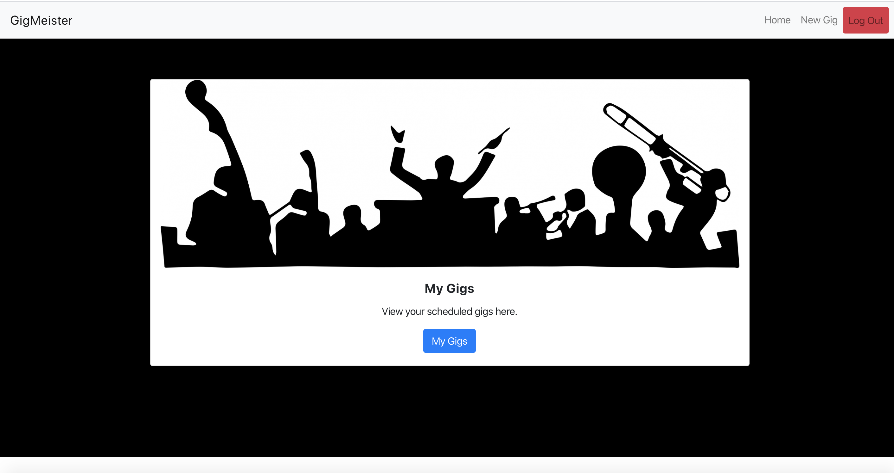
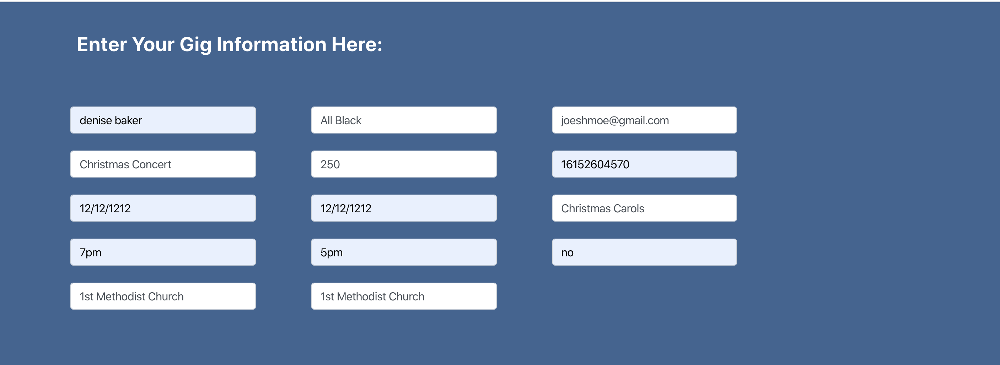
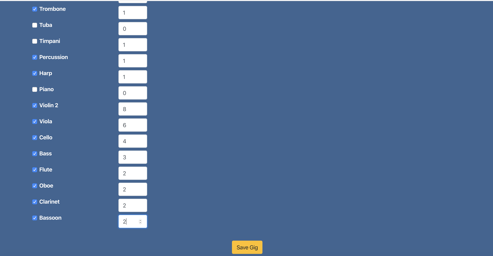
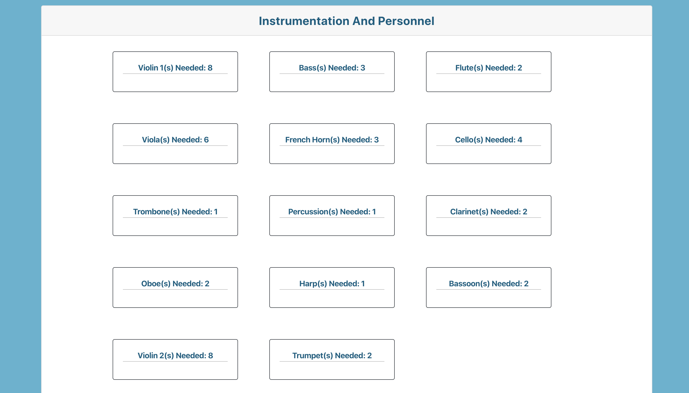
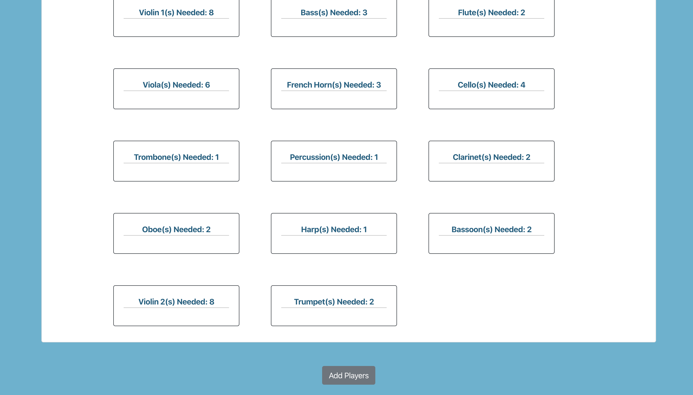
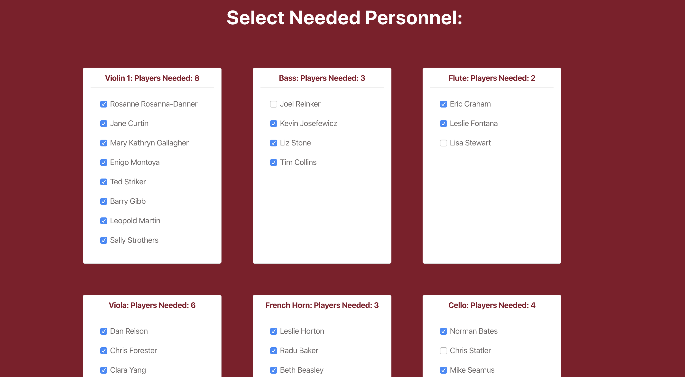
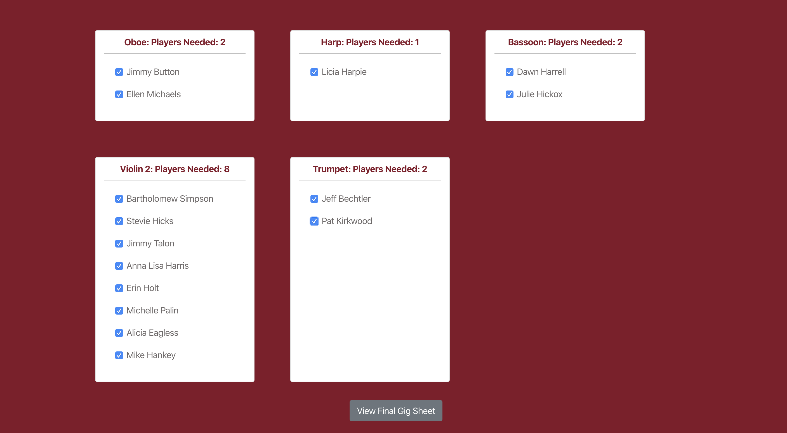
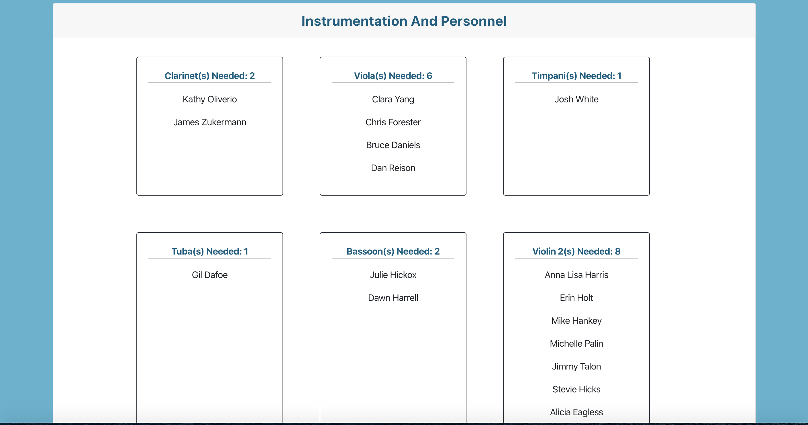
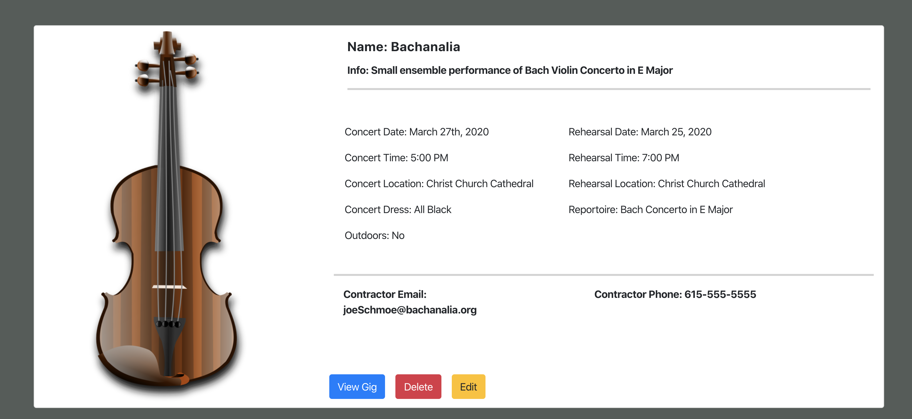

# NSS Front-End Capstone -- "GigMeister"
Create an application using the following:

## Specs

* REACT
* Firebase CRUD
* Bootstrap
* Use Github Projects for Planning

## Technologies Used

* HTML5, CSS, Javascript
* SASS 4.13.1 for all customized styling
* React 16.12.0 for core app functionality
* Firebase 7.7.0 for authentication and data storage

## Description:

An application for classical musicians to create and edit a large scale ensemble such as a symphony orchestra.

